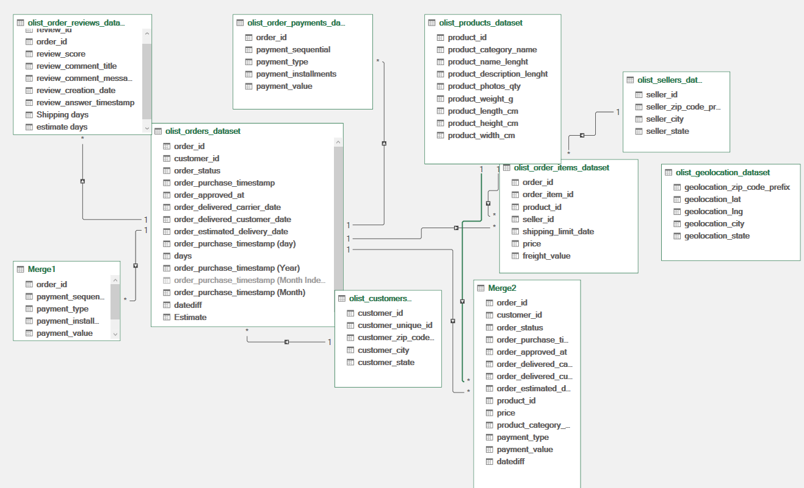
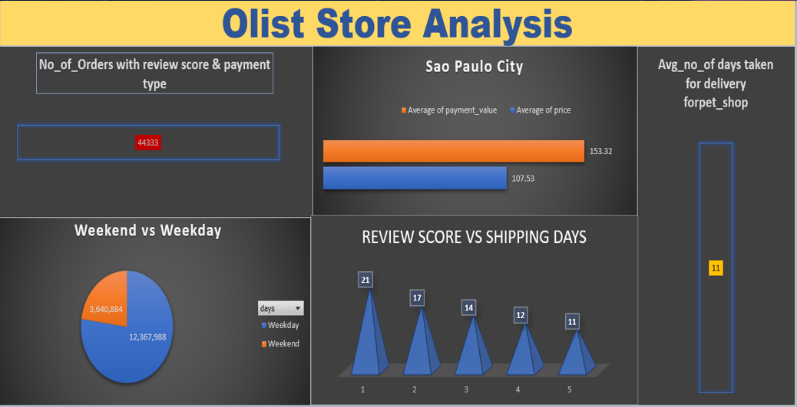

# Olist Store Analysis

### SKills Used:
- Power Pivot
- Pivot Table
- Calcualted Field
- Data Model in Power Pivot
### Problem Statement
1. Weekday Vs Weekend (order_purchase_timestamp) Payment Statistics

2. Number of Orders with review score 5 and payment type as credit card.

3. Average number of days taken for order_delivered_customer_date for pet_shop

4. Average price and payment values from customers of sao paulo city

5. Relationship between shipping days (order_delivered_customer_date - order_purchase_timestamp) Vs review scores.

### Data Model

## DASHBOARD

