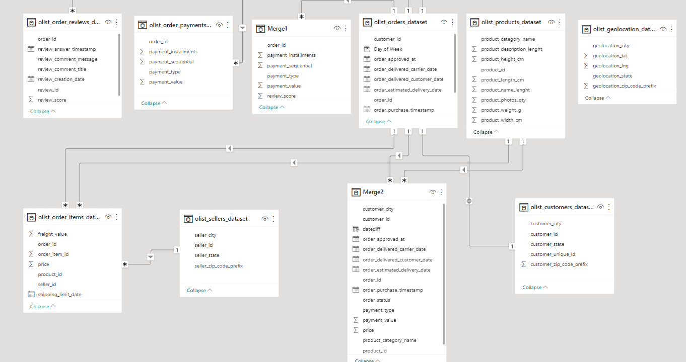
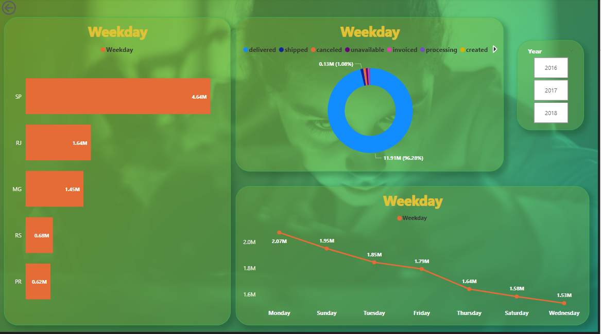
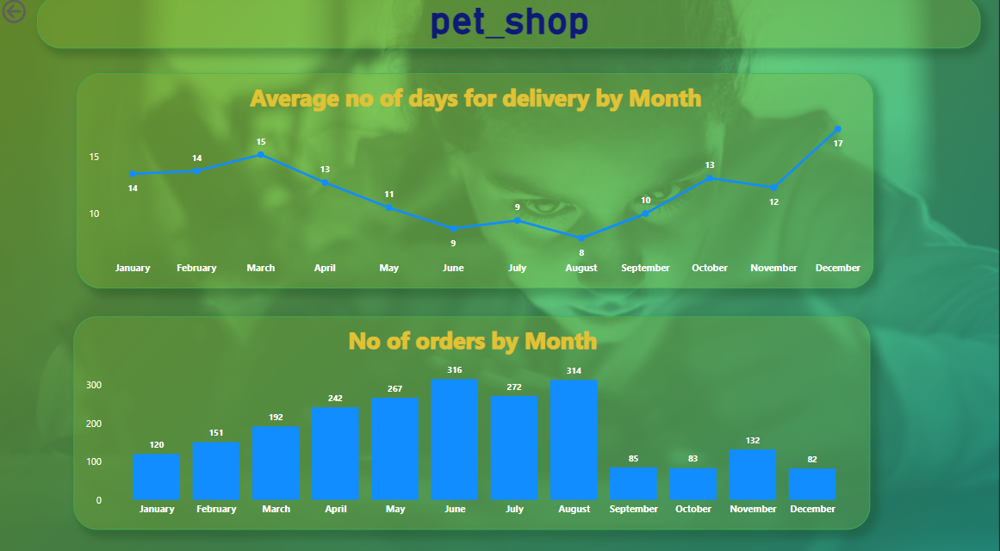
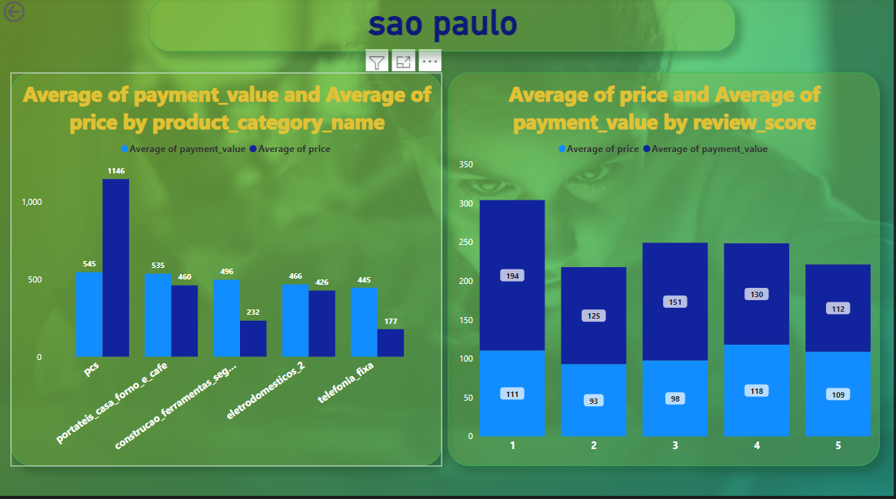

# Olist Store Analysis

## Introduction :
This is a power Bi Project on "Store Analysis". The project is to analyze and derive insights to answer crucial 
questions and help the store make data driven decisions.

### Data Set : 9 Data Sets Provided

### Problem Statement
1. Weekday Vs Weekend (order_purchase_timestamp) Payment Statistics
2.  Number of Orders with review score 5 and payment type as credit card.
3. Average number of days taken for order_delivered_customer_date for pet_shop
4. Average price and payment values from customers of sao paulo city
5. Relationship between shipping days (order_delivered_customer_date - order_purchase_timestamp) Vs review scores.

#### Skills Used :
The following Power Bi features were incorporated:

- Power Query For ETL process : Removed duplicates, Imputed Null Values with meaning data, Checked Data Types
- Data Modelling : Challenge based with many to many relationship overcome with creating Bridge Table
- DAX function used
- Drill Through used to navinagate Detailed report
- Drill down and drill up used
- Bookmark and selection used
- Slicer and Fillters used.
- Buttons and Page Navigation : used to access various reports
### Data Modelling:

### DashBoard: 
#### Main Dashboard

#### Weekday Vs Weekend (order_purchase_timestamp) Payment Statistics
When clicking weekday/weekend in Donut chart in main dashboard its navigated only to weekday/weekend through Drill-through.
      
 Weekday                                         |                     Weekend
:-----------------------------------------------:|:----------------------------------------------:
               |  

#### Number of Orders with review score 5 and payment type as credit card

#### Average number of days taken for order_delivered_customer_date for pet_shop

#### Average price and payment values from customers of sao paulo city

#### Relationship between shipping days (order_delivered_customer_date - order_purchase_timestamp) Vs review scores.

