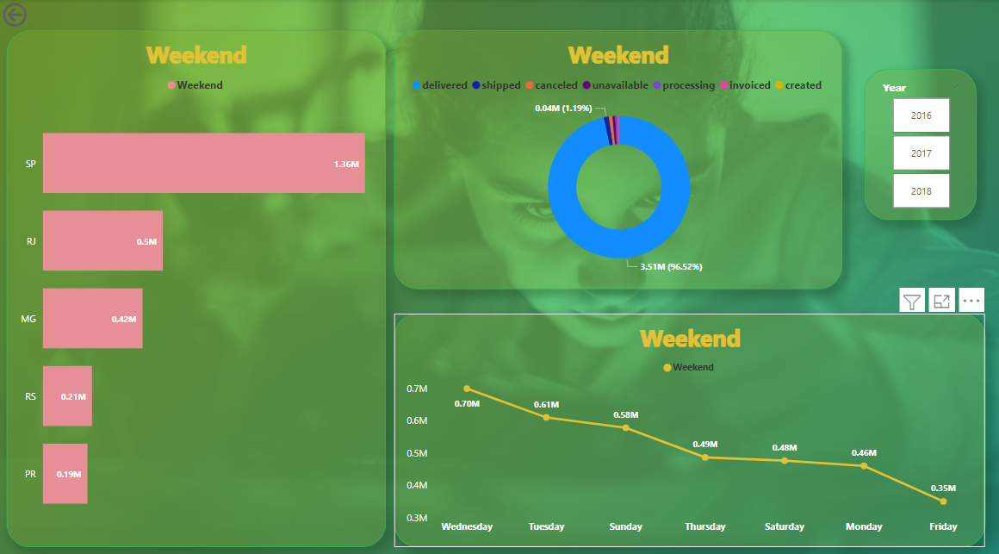

## Power BI - Olist Store Analysis

### Data Set : 9 Data Sets Provided
#### Skills Used : 
      - Power Query For ETL process : Removed duplicates, Imputed Null Values with meaning data, Checked Data Types
      - Data Modelling : Challenge based with many to many relationship overcome with creating Bridge Table
      - DAX function used
      - Drill Through used to navinagate Detailed report
      - Drill down and drill up used
      - Bookmark and selection used
      - Slicer and Fillters used.
      - Buttons and Navigation used to access various reports
### Data Modelling:

### DashBoard: 
#### Main Dashboard

#### Weekday Vs Weekend
      When clicking weekday in Donut chart in main dashboard its navigated to only to weekday through Drill-through.
      
Weekday                                          |                     Weekend
:-----------------------------------------------:|:----------------------------------------------:
                        

#### 

