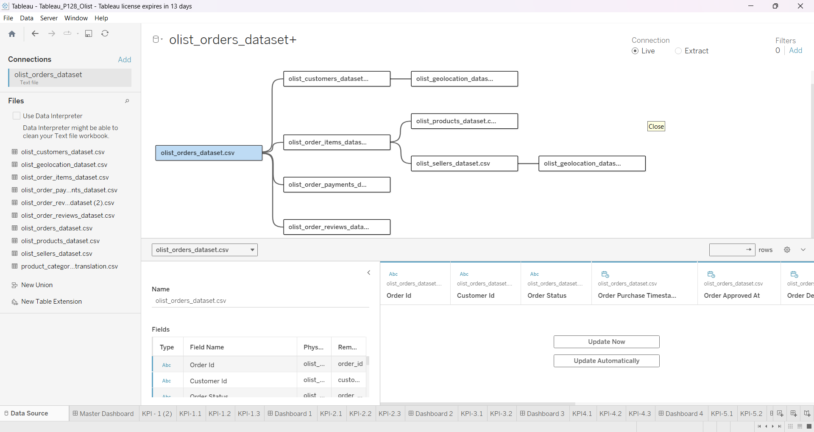
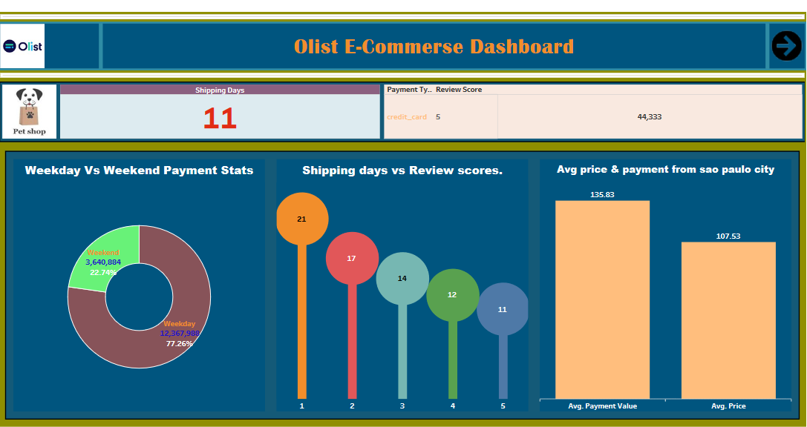
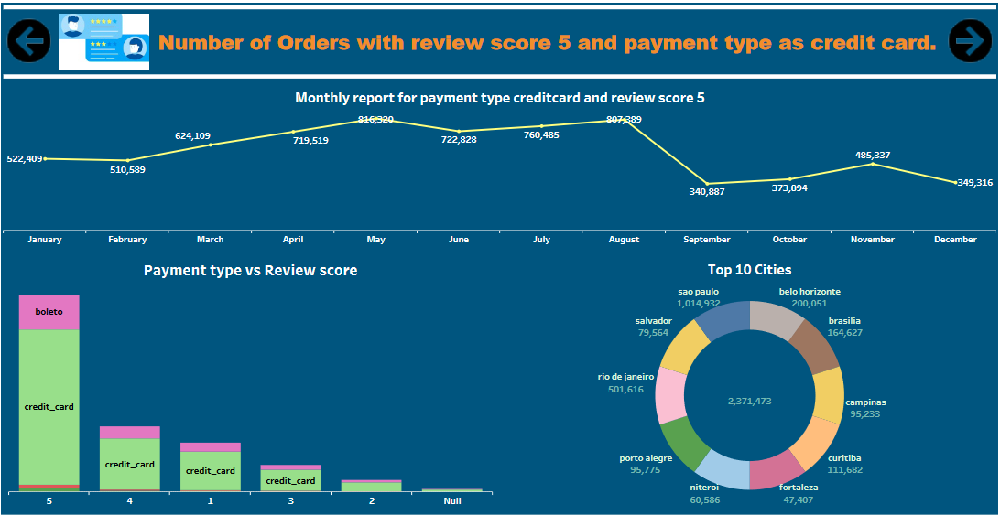
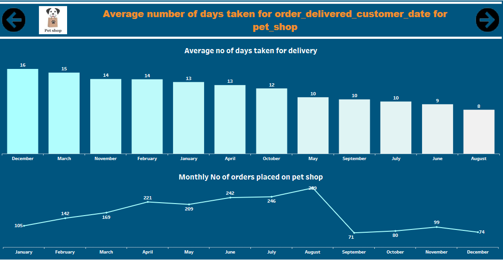
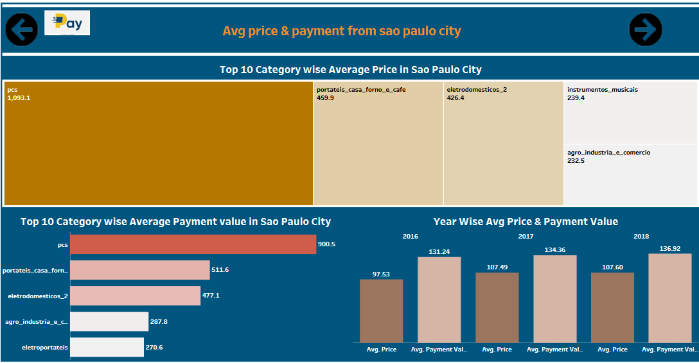

# Olist Store Analysis Tableau Dashboard Visualization

## Introduction :
This is a Tableau Project on "OList Store Analysis". The project is to analyze and derive insights to answer crucial 
questions and help the store make data driven decisions.

### Data Set : 9 Data Sets Provided
### Dashboard : [Click here to access interactive Dashboard in Tableau Public](https://public.tableau.com/shared/BNKCJJCN8?:display_)

### Problem Statement
1. Weekday Vs Weekend (order_purchase_timestamp) Payment Statistics
2. Number of Orders with review score 5 and payment type as credit card.
3. Average number of days taken for order_delivered_customer_date for pet_shop
4. Average price and payment values from customers of sao paulo city
5. Relationship between shipping days (order_delivered_customer_date - order_purchase_timestamp) Vs review scores.

#### Skills Used :
The following Tableau features were incorporated:

- filters, parameters, and actions (e.g., filter actions, URL actions, highlight actions).
- Custom Formatting and Design
- Data Extracts  
- Embedded Dashboards
- Data Blending and Joins
- Calculated Fields and table calculations, such as running totals, moving averages, or ratios.
- Slicer and Fillters used.
  
### Data Source Connectivity and Modelling:

### Main Dashboard

#### Other Interactive Dashboards based on KPI's from main Dashboard
#### Weekday Vs Weekend (order_purchase_timestamp) Payment Statistics

#### Number of Orders with review score 5 and payment type as credit card.

#### Average number of days taken for order_delivered_customer_date for pet_shop

#### Average price and payment values from customers of sao paulo city

#### Relationship between shipping days (order_delivered_customer_date - order_purchase_timestamp) Vs review scores

